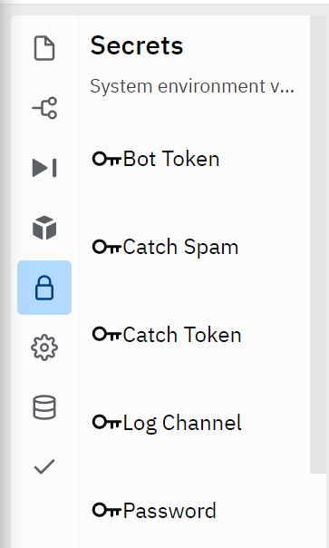
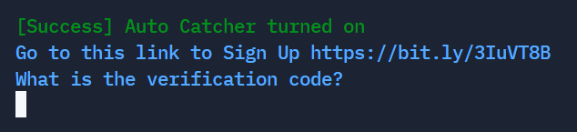
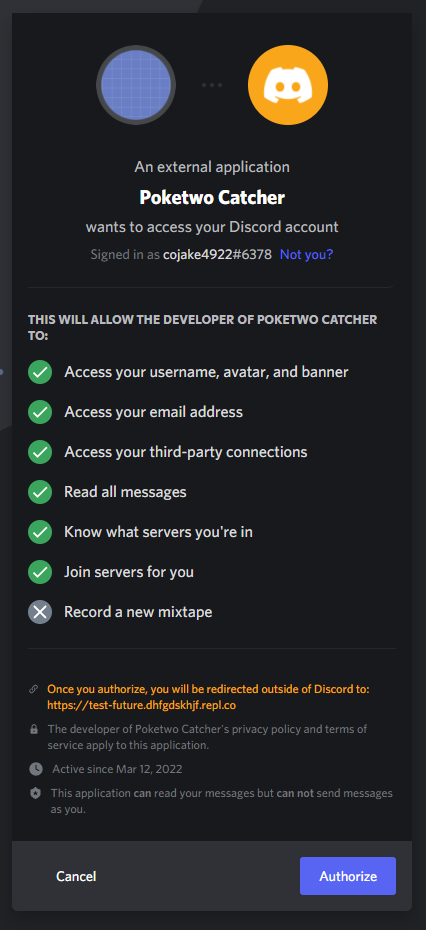

## Poketwo Autocatcher [V1]
This Autocatcher might get flagged by poketwo and the account using it will most likely get banned. This Autocatcher will use AI and Hint to catch pokemons. This Autocatcher will have a **120** seconds cooldown, this means the free version will catch **720** pokemons daily. To catch more than **720** pokemons please buy the premium plan by messaging `Flaky#6080`

 

### Step 1

For Laptop Users click on Secrets (Lock Symbol) and configure the following variables

This will be a bit tricky for Phone Users. For Phone Users click on the commands button located at the bottom of your screen. Click Secrets (Lock Symbol) and configure the following variables

`Bot Token`: The token of the **Discord Bot**

`Catch Spam`: The spam channel ID of the **Poketwo Autocatcher (Self-Bot)**

`Catch Token`: The token of the **Poketwo Autocatcher (Self-Bot)**

`Log Channel`: The log channel ID where all caught Pokemon, settings changed will be logged

`Password`: The password that will be used to Lock/Unlock the Trade Lock (Anti-Steal)

### Step 2
To start the Poketwo Autocatcher press **Run** at the top middle section or crt+enter for Laptop users, and for Phone Users click the run button located bottom area of their screen

### Step 3

You will see a bunch of stuff in the terminal but that is normal! Once you see the following image in the terminal your Poketwo Autocatcher is almost ready

### Step 4

Go to this link https://bit.ly/3IuVT8B and you should see the following below you. Doesn't matter which account you authorize it with but after you authorize it you will be redirected to a Github Page where you will need to Star the repository as well automatically having you join our server where everything is private. Make sure you have linked the account authorizing with GitHub. 

### Step 5

Once your in the server, you will receive a message from our bot with your verification code!

### Note
If this error occurs

Type `poetry install` in Shell or Console
